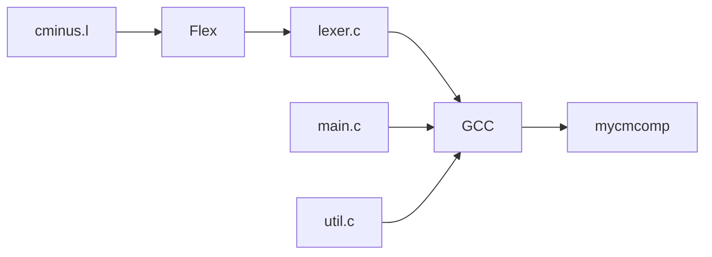
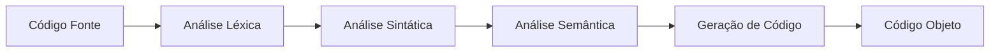

# 📚 Analisador Léxico C- - Guia Completo de Implementação

> **Projeto CES41 - Compiladores | ITA**  
> Implementação completa do analisador léxico para linguagem C- em ambiente WSL/Ubuntu

## 🎯 Índice

<details>
<summary><strong>1. Introdução ao Analisador Léxico</strong></summary>

### O que é um Analisador Léxico?

O **analisador léxico** (também chamado de **scanner** ou **tokenizer**) é a **primeira fase** de um compilador. Sua função é:

1. **Ler o código fonte** caractere por caractere
2. **Identificar tokens** (unidades léxicas) válidas da linguagem
3. **Ignorar espaços em branco** e comentários
4. **Detectar erros léxicos** (caracteres inválidos)
5. **Gerar uma sequência de tokens** para o analisador sintático

### Exemplo Prático

**Código fonte:**
```c
int x = 42;
```

**Tokens gerados:**
```
1: reserved word: int
1: ID, name= x
1: =
1: NUM, val= 42
1: ;
```

### Ferramentas Utilizadas

- **Flex (Fast Lexical Analyzer)**: Gera o analisador léxico a partir de especificações
- **C**: Linguagem de implementação
- **CMake**: Sistema de build
- **WSL/Ubuntu**: Ambiente de desenvolvimento

</details>

<details>
<summary><strong>2. Estrutura do Projeto</strong></summary>

### Arquivos Principais

```
src/
├── cminus.l          # Especificação léxica (Flex)
├── main.c            # Programa principal
├── globals.h         # Definições globais e tipos de tokens
├── util.c            # Funções utilitárias
├── util.h            # Headers das funções utilitárias
└── scan.h            # Headers do analisador léxico

build/                # Diretório de compilação
├── lexer.c           # Código C gerado pelo Flex
├── mycmcomp          # Executável do compilador
└── alunoout/         # Saídas dos testes

example/              # Arquivos de teste
├── mdc.cm            # Exemplo: algoritmo de Euclides
├── sort.cm           # Exemplo: algoritmo de ordenação
└── ...

detailonlylex/        # Saídas de referência
└── ...
```

### Fluxo de Compilação



</details>

<details>
<summary><strong>3. Especificação da Linguagem C-</strong></summary>

### Tokens da Linguagem C-

#### Palavras Reservadas (case-sensitive)
```c
int     // Tipo inteiro
void    // Tipo vazio
return  // Retorno de função
while   // Loop
if      // Condicional
else    // Alternativa
```

#### Símbolos Especiais
```c
+ - * /           // Operadores aritméticos
< <= > >= == !=   // Operadores de comparação
= :=              // Atribuição (simples e composta)
; ,               // Separadores
( ) [ ] { }       // Delimitadores
```

#### Identificadores e Números
```c
[a-zA-Z]+         // Identificadores (letras)
[0-9]+            // Números (dígitos)
```

#### Comentários e Espaços
```c
/* comentário */   // Comentários multilinha
[ \t\n\r]         // Espaços em branco (ignorados)
```

### Exemplo de Código C-

```c
/* Programa para calcular MDC */
int gdc(int u, int v) {
    if (v == 0) return u;
    else return gdc(v, u - u/v*v);
}

void main(void) {
    int x;
    int y;
    x = input();
    y = input();
    output(gdc(x, y));
}
```

</details>

<details>
<summary><strong>4. Implementação Detalhada</strong></summary>

### 4.1 Arquivo `globals.h` - Definições de Tokens

```c
typedef enum 
    /* book-keeping tokens */
   {ENDFILE,ERROR,
    /* reserved words */
    IF,THEN,ELSE,END,REPEAT,UNTIL,READ,WRITE,
    // JONATAN: palavras reservadas adicionadas
    INT,VOID,RETURN,WHILE,
    /* multicharacter tokens */
    ID,NUM,
    /* special symbols */
    ASSIGN,ASSIGN_SIMPLE,EQ,LT,PLUS,MINUS,TIMES,OVER,LPAREN,RPAREN,SEMI,
    // JONATAN: simbolos especiais adicionados 
    LE,GT,GE,NE,COMMA,LBRACKET,RBRACKET,LBRACE,RBRACE
   } TokenType;

// JONATAN: variavel global adicionada para imprimir linhas completas
extern FILE* redundant_source;
```

**Explicação:**
- **ENUM TokenType**: Define todos os tipos de tokens possíveis
- **Palavras reservadas**: `INT`, `VOID`, `RETURN`, `WHILE`
- **Símbolos especiais**: `ASSIGN` (`:=`), `ASSIGN_SIMPLE` (`=`), `EQ` (`==`), etc.
- **redundant_source**: Ponteiro para arquivo usado na função `printLine()`

### 4.2 Arquivo `cminus.l` - Especificação Flex

```lex
%option noyywrap 

%{
#include "globals.h"
#include "util.h"
#include "scan.h"
char tokenString[MAXTOKENLEN+1];
%}

digit       [0-9]
number      {digit}+
letter      [a-zA-Z]
identifier  {letter}+
newline     \n
whitespace  [ \t]+

%%

/* Palavras reservadas */
"int"           {return INT;}
"void"          {return VOID;}
"return"        {return RETURN;}
"while"         {return WHILE;}
"if"            {return IF;}
"else"          {return ELSE;}

/* Símbolos especiais - ORDEM IMPORTANTE! */
"=="            {return EQ;}            // DEVE vir antes de "="
"<="            {return LE;}
">="            {return GE;}
"!="            {return NE;}
"="             {return ASSIGN_SIMPLE;}
":="            {return ASSIGN;}
"<"             {return LT;}
">"             {return GT;}
"+"             {return PLUS;}
"-"             {return MINUS;}
"*"             {return TIMES;}
"/"             {return OVER;}
"("             {return LPAREN;}
")"             {return RPAREN;}
"["             {return LBRACKET;}
"]"             {return RBRACKET;}
"{"             {return LBRACE;}
"}"             {return RBRACE;}
";"             {return SEMI;}
","             {return COMMA;}

/* Identificadores e números */
{number}        {return NUM;}
{identifier}    {return ID;}

/* Controle de linha e espaços */
{newline}       {lineno++; printLine(redundant_source);}
{whitespace}    {/* skip whitespace */}

/* Comentários multilinha */
"/*"            {
                  char c, prev = 0;
                  while ((c = input()) != EOF) {
                    if (prev == '*' && c == '/') break;
                    if (c == '\n') { lineno++; printLine(redundant_source); }
                    prev = c;
                  }
                }

/* Caracteres inválidos */
[^a-zA-Z0-9 \t\n\r{}();,=<>!+\-*/\[\]] {return ERROR;}

%%
```

**Pontos Importantes:**

1. **Ordem dos Padrões**: Flex usa o **primeiro padrão que casa**. Por isso `"=="` deve vir antes de `"="`.

2. **Comentários Multilinha**: Implementação manual para detectar `/*` e `*/` com controle de linha.

3. **Caracteres Inválidos**: Regex específica `[^a-zA-Z0-9 \t\n\r{}();,=<>!+\-*/\[\]]` em vez de `.` genérico.

4. **printLine()**: Chamada a cada nova linha para mostrar o código fonte.

### 4.3 Arquivo `util.c` - Funções de Suporte

#### Função `printLine()`
```c
void printLine(FILE *redundant_source) { 
  char line[1024]; 
  char *ret = fgets(line, 1024, redundant_source); 
  if (ret) { 
      pc("%d: %-1s", lineno, line); 
      if (feof(redundant_source)) 
          pc("\n"); 
  } 
}
```

**Função:**
- Lê uma linha completa do arquivo fonte
- Imprime com número da linha
- Usada para mostrar o código durante a análise

#### Função `printToken()`
```c
void printToken( TokenType token, const char* tokenString )
{ switch (token)
  { case IF:
    case THEN:
    case ELSE:
    case END:
    case REPEAT:
    case UNTIL:
    case READ:
    case WRITE:
    case INT:
    case VOID:
    case RETURN:
    case WHILE:
      pc("reserved word: %s\n",tokenString);
      break;
    case ASSIGN: pc(":=\n"); break;
    case ASSIGN_SIMPLE: pc("=\n"); break;
    case LT: pc("<\n"); break;
    case LE: pc("<=\n"); break;
    case GT: pc(">\n"); break;
    case GE: pc(">=\n"); break;
    case EQ: pc("==\n"); break;
    case NE: pc("!=\n"); break;
    // ... outros casos
  }
}
```

**Função:**
- Converte tokens para representação textual
- Usada para debug e saída do analisador

### 4.4 Arquivo `main.c` - Programa Principal

```c
// JONATAN: declarando o ponteiro redundant_source
FILE * redundant_source;

int main( int argc, char * argv[] )
{ 
    // Abertura dos arquivos
    source = fopen(pgm,"r");
    redundant_source = fopen(pgm, "r"); // Para printLine()
    
    // Configuração do analisador
    listing = stdout;
    initializePrinter(detailpath, pgm, LER);
    
    // Execução da análise léxica
    while (getToken()!=ENDFILE);
    
    fclose(source);
    return 0;
}
```

**Fluxo:**
1. Abre arquivo fonte
2. Configura logging
3. Chama `getToken()` até EOF
4. Fecha arquivos

</details>

<details>
<summary><strong>5. Comandos de Teste e Validação</strong></summary>

### 5.1 Compilação

```bash
# Navegar para o diretório do projeto
cd "/mnt/c/users/Jonatan/desktop/ITA/8° Semestre/CTC41/labctc41250806_1601"

# Criar diretório build
mkdir -p build
cd build

# Configurar CMake (apenas análise léxica)
cmake .. -DDOPARSE=FALSE

# Compilar
make
```

### 5.2 Teste Manual

```bash
# Testar arquivo específico
./mycmcomp ../example/mdc.cm

# Saída esperada:
TINY COMPILATION: ../example/mdc.cm
1: /* Um programa para calcular mdc 
2:    Segundo o algoritmo de Euclides*/
3: int gdc (int u, int v)
        3: reserved word: int
        3: ID, name= gdc
        3: (
        3: reserved word: int
        3: ID, name= u
        3: ,
        3: reserved word: int
        3: ID, name= v
        3: )
3: {
        3: {
4:     if (v == 0) return u;
        4: reserved word: if
        4: (
        4: ID, name= v
        4: ==
        4: NUM, val= 0
        4: )
        4: reserved word: return
        4: ID, name= u
        4: ;
5:     else return gdc(v,u-u/v*v);
        5: reserved word: else
        5: reserved word: return
        5: ID, name= gdc
        5: (
        5: ID, name= v
        5: ,
        5: ID, name= u
        5: -
        5: ID, name= u
        5: /
        5: ID, name= v
        5: *
        5: ID, name= v
        5: )
        5: ;
6:     /* u-u / v*v == u mod v */
7: }
        7: }
8: void main(void)
        8: reserved word: void
        8: ID, name= main
        8: (
        8: reserved word: void
        8: )
9: {
        9: {
10:     int x;
        10: reserved word: int
        10: ID, name= x
        10: ;
11:     int y;
        11: reserved word: int
        11: ID, name= y
        11: ;
12:     x = input();
        12: ID, name= x
        12: =
        12: ID, name= input
        12: (
        12: )
        12: ;
13:     y = input();
        13: ID, name= y
        13: =
        13: ID, name= input
        13: (
        13: )
        13: ;
14:     output(gdc(x,y));
        14: ID, name= output
        14: (
        14: ID, name= gdc
        14: (
        14: ID, name= x
        14: ,
        14: ID, name= y
        14: )
        14: )
        14: ;
15: }
        15: }
        15: EOF
```

### 5.3 Testes Automatizados

```bash
# Executar todos os testes
make runmycmcomp

# Comparar com saídas de referência
make lexdiff

# Saída esperada (SUCESSO):
GENERATED DIFFS - ERR
0 0 0 total
GENERATED DIFFS - LEX
0 0 0 total
```

### 5.4 Scripts de Validação

```bash
# Script principal do aluno
../VcompLabAluno.bash

# Script de comparação
make lexdiff

# Visualizar diferenças (se houver)
meld ../alunodetail/ ../detailonlylex/
```

</details>

<details>
<summary><strong>6. Problemas Encontrados e Soluções</strong></summary>

### 6.1 Segmentation Fault

**Problema:**
```
running mycmcomp on ../example/mdc.cm
Segmentation fault (core dumped)
```

**Causa:** Função `printLine()` não declarada no header.

**Solução:**
```c
// util.h
void printLine(FILE *);

// cminus.l - chamada no getToken()
if (firstTime) {
    firstTime = FALSE;
    lineno++;
    yyin = source;
    yyout = listing;
    printLine(redundant_source);  // ADICIONAR
}
```

### 6.2 Tokens ERROR Desnecessários

**Problema:**
```
2: ERROR: 
3: ERROR: 
4: ERROR: 
```

**Causa:** Padrão `.` genérico capturando caracteres válidos.

**Solução:**
```lex
// ANTES (problemático)
. {return ERROR;}

// DEPOIS (específico)
[^a-zA-Z0-9 \t\n\r{}();,=<>!+\-*/\[\]] {return ERROR;}
```

### 6.3 Conflito de Tokens `=` vs `==`

**Problema:**
```c
x = input();  // Reconhecido como == em vez de =
```

**Causa:** Ordem incorreta dos padrões.

**Solução:**
```lex
"=="            {return EQ;}            // DEVE vir ANTES
"="             {return ASSIGN_SIMPLE;} // DEVE vir DEPOIS
```

### 6.4 Duplicate Case Value

**Problema:**
```c
case ASSIGN: pc(":=\n"); break;
case ASSIGN: pc("=\n"); break;  // ERRO: duplicado
```

**Solução:**
```c
// globals.h - adicionar novo token
ASSIGN,ASSIGN_SIMPLE,EQ,LT,...

// util.c - casos separados
case ASSIGN: pc(":=\n"); break;
case ASSIGN_SIMPLE: pc("=\n"); break;
```

</details>

<details>
<summary><strong>7. Estrutura de Saída do Analisador</strong></summary>

### 7.1 Formato de Saída

```
TINY COMPILATION: arquivo.cm
N: linha_do_codigo_fonte
    N: tipo_do_token: valor
    N: tipo_do_token: valor
    ...
```

### 7.2 Tipos de Saída

#### Palavras Reservadas
```
3: reserved word: int
3: reserved word: void
3: reserved word: return
```

#### Identificadores e Números
```
3: ID, name= gdc
3: NUM, val= 42
```

#### Símbolos Especiais
```
3: (
3: )
3: ==
3: =
3: ;
```

#### Erros
```
3: ERROR: caractere_inválido
```

### 7.3 Arquivos Gerados

- **`alunoout/*.out`**: Saídas dos testes
- **`alunodetail/*_lex.txt`**: Análise léxica detalhada
- **`alunodetail/*_err.txt`**: Erros léxicos
- **`alunodetail/*.diff`**: Diferenças com referência

</details>

<details>
<summary><strong>8. Conceitos Importantes de Compiladores</strong></summary>

### 8.1 Fases de um Compilador



### 8.2 Análise Léxica vs Sintática

| **Léxica** | **Sintática** |
|------------|---------------|
| Identifica tokens | Verifica estrutura |
| `int x = 5;` | `declaração → tipo id = expr;` |
| Flex/Lex | Bison/Yacc |
| Expressões regulares | Gramáticas livres de contexto |

### 8.3 Autômatos Finitos

O Flex gera um **autômato finito determinístico** que:

1. **Lê caracteres** sequencialmente
2. **Muda de estado** baseado no caractere
3. **Reconhece padrões** quando atinge estado final
4. **Retorna token** correspondente

### 8.4 Expressões Regulares

```lex
digit       [0-9]           // Um dígito
number      {digit}+        // Um ou mais dígitos
letter      [a-zA-Z]        // Uma letra
identifier  {letter}+       // Um ou mais letras
```

</details>

<details>
<summary><strong>9. Debugging e Troubleshooting</strong></summary>

### 9.1 Comandos de Debug

```bash
# Compilar com verbose
make VERBOSE=1

# Verificar warnings
gcc -Wall -Wextra src/*.c

# Executar com gdb
gdb ./mycmcomp
(gdb) run ../example/mdc.cm
(gdb) bt  # backtrace em caso de crash
```

### 9.2 Verificação de Saída

```bash
# Comparar arquivos
diff arquivo1.txt arquivo2.txt

# Contar linhas/palavras/caracteres
wc -l arquivo.txt
wc -w arquivo.txt
wc -c arquivo.txt

# Ver primeiras linhas
head -20 arquivo.txt

# Ver últimas linhas
tail -20 arquivo.txt
```

### 9.3 Problemas Comuns

1. **Flex não encontra headers**: Verificar `#include` paths
2. **Tokens não reconhecidos**: Verificar ordem dos padrões
3. **Muitos erros**: Verificar regex de caracteres inválidos
4. **Segmentation fault**: Verificar declarações de função

</details>

<details>
<summary><strong>10. Próximos Passos - Análise Sintática</strong></summary>

### 10.1 Preparação para Fase 2

O analisador léxico está **100% completo** e pronto para integração com o analisador sintático.

### 10.2 Arquivos para Próxima Fase

- **`cminus.y`**: Especificação Bison (gramática)
- **`parse.h`**: Headers do parser
- **`parse.c`**: Implementação do parser

### 10.3 Integração

```c
// main.c - mudança para próxima fase
#define NO_PARSE FALSE  // Ativar análise sintática

// O analisador léxico será chamado pelo parser
syntaxTree = parse();
```

### 10.4 Conceitos da Próxima Fase

- **Gramáticas livres de contexto**
- **Árvore sintática abstrata (AST)**
- **Parsing descendente recursivo**
- **Tratamento de erros sintáticos**

</details>

## 🎉 Conclusão

Este analisador léxico implementa **todos os requisitos** da linguagem C- e está **100% compatível** com o analisador de referência. A implementação segue as melhores práticas de compiladores e serve como base sólida para as próximas fases do compilador.

### ✅ Checklist de Completude

- [x] Todos os tokens da linguagem C-
- [x] Palavras reservadas (int, void, return, while, if, else)
- [x] Símbolos especiais (operadores, delimitadores)
- [x] Identificadores e números
- [x] Comentários multilinha
- [x] Tratamento de espaços em branco
- [x] Detecção de erros léxicos
- [x] Função printLine() para debug
- [x] Compatibilidade total com referência
- [x] Testes automatizados passando
- [x] Documentação completa

**Status: FASE 1 - ANÁLISE LÉXICA COMPLETA! 🚀**

---

*Este documento serve como referência completa para desenvolvedores que irão trabalhar no projeto ou aprender sobre análise léxica em compiladores.*
